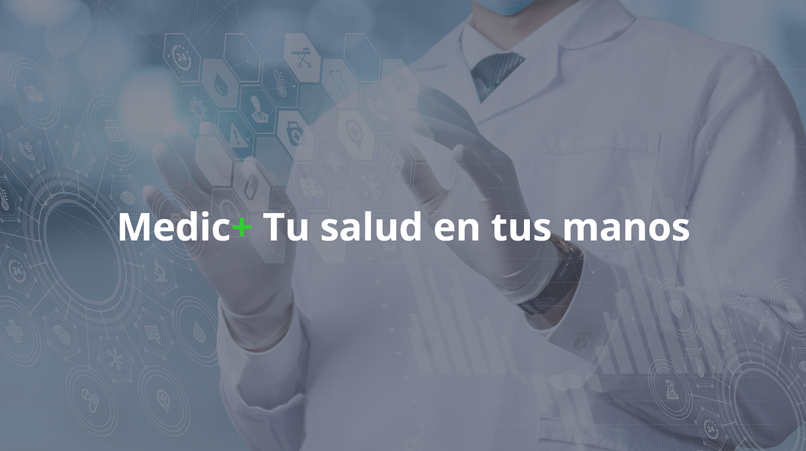
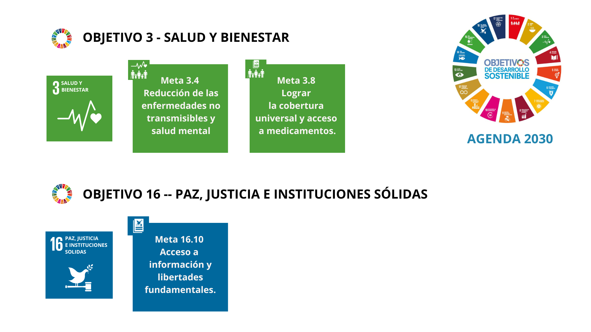
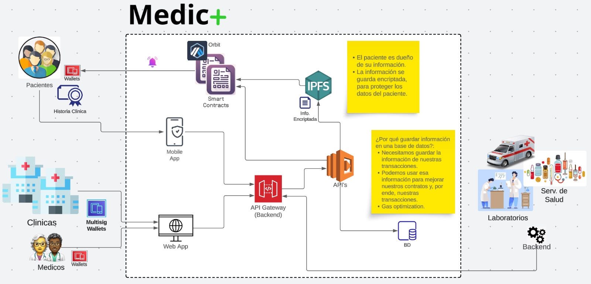
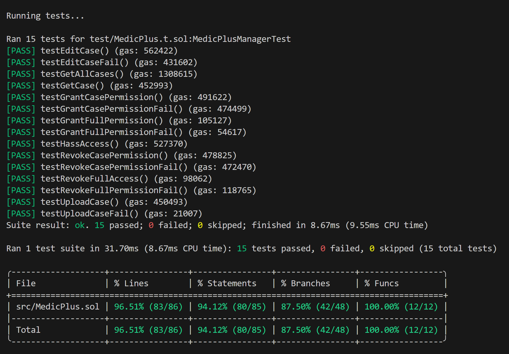
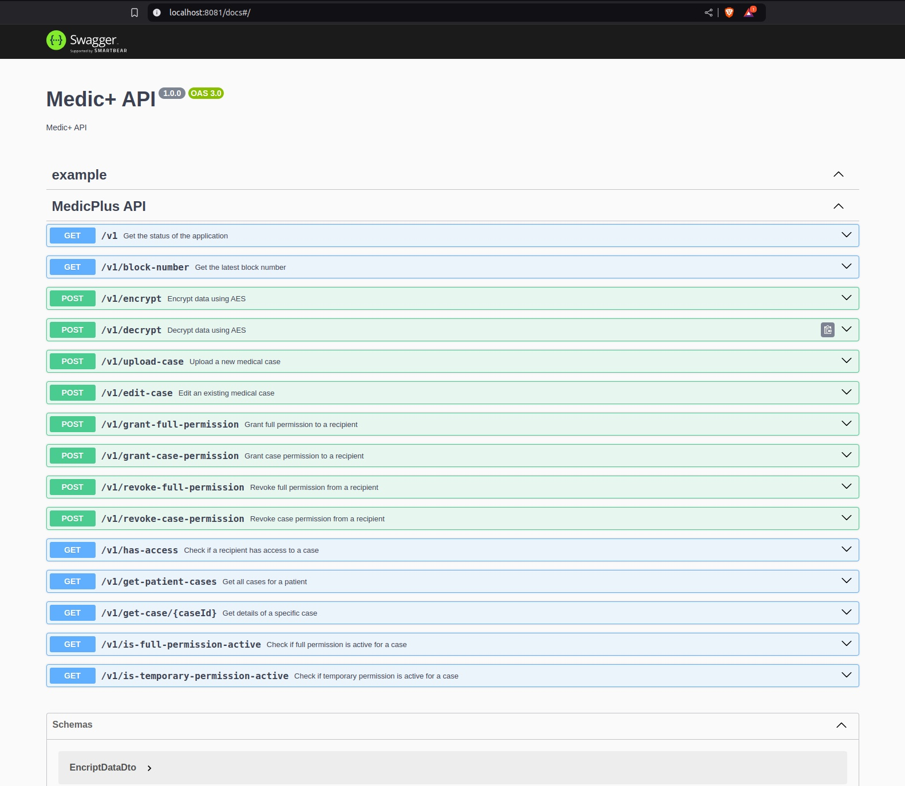
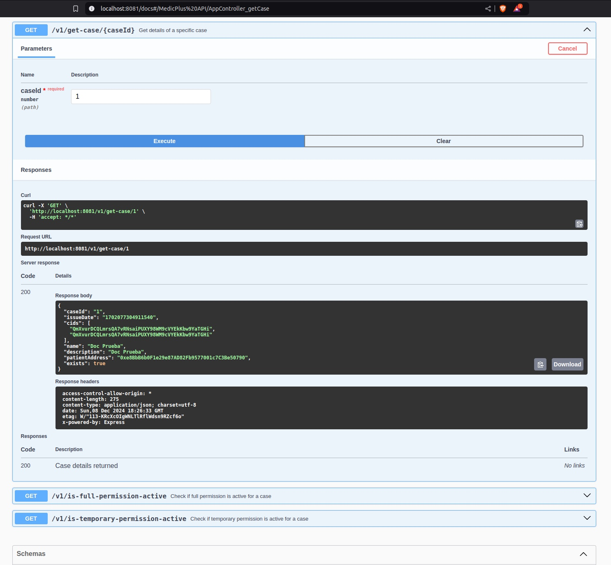

# Descripción del proyecto



# Medic+

**Medic+** es una solución descentralizada diseñada para transformar la gestión y el control de los historiales médicos personales. Basada en tecnología blockchain, garantiza la privacidad y seguridad de los datos, otorgando a los pacientes el control total sobre quién puede acceder a su información y en qué momento.

Con **Medic+**, compartir datos médicos de forma cómoda y segura se convierte en una realidad, permitiendo a los pacientes acceder a todas las posibilidades que ofrece la telemedicina y la prevención avanzada. Esto incluye la facilidad de obtener segundas opiniones o realizar estudios preventivos con cualquier clínica o especialista, tanto de manera presencial como online.

Además, **Medic+** integra un innovador asistente de inteligencia artificial capaz de traducir diagnósticos médicos en términos claros y comprensibles. Este asistente también sugiere estudios adicionales o cambios en los hábitos de vida basados en normativas internacionales, como las guías de la Organización Mundial de la Salud (OMS). Todo esto se realiza con un enfoque en la privacidad del usuario y un análisis avanzado de sus datos médicos.

**Medic+** no solo empodera a los pacientes, sino que también establece un nuevo estándar en la gestión de información médica al combinar seguridad, accesibilidad e innovación tecnológica.

## Alineado con los siguientes ODS

### OBJETIVO 3 - Salud y bienestar

### OBJETIVO 16 - Paz, justicia e instituciones sólidas



## Características principales

- **Seguridad y control total:** Almacenamiento descentralizado en blockchain para prevenir manipulaciones o pérdidas de datos.
- **Empoderamiento del paciente:** El paciente decide quién accede a su historial médico y cuándo.
- **Acceso global a opiniones médicas:** Se comparten los datos de forma segura con cualquier médico o clínica, ya sea presencial u online, accediendo a todo el potencial de la telemedicina y la prevención avanzado mediante el estudio de los datos.
- **IA alineada con normativas sanitarias:** Garantiza información confiable y ética al operar bajo estándares como los de la OMS y guías nacionales.

## Workflow de Medic+

### 1. Registro de usuario y configuración inicial

- Los pacientes se registran en la plataforma vinculando su identidad con una dirección de wallet descentralizada.
- Se generan claves criptográficas para garantizar la privacidad y seguridad de los datos almacenados en la blockchain.

### 2. Subida de datos médicos

- Los datos médicos (informes, diagnósticos, análisis, etc.) se almacenan en un sistema descentralizado como IPFS o Arweave.
- Los metadatos de los registros se vinculan a un contrato inteligente en la blockchain, donde el paciente conserva el control sobre los permisos de acceso.

### 3. Gestión de permisos

- Los pacientes deciden qué especialistas o instituciones tienen acceso a sus datos y por cuánto tiempo.
- El acceso se verifica mediante el contrato inteligente y requiere la aprobación explícita del paciente.

### 4. Análisis avanzado y asistente de IA

- El asistente de IA analiza los datos médicos almacenados y proporciona:
  - Explicaciones claras de diagnósticos.
  - Recomendaciones basadas en normativas globales, como las guías de la OMS, si son solicitadas.
  - Sugerencias personalizadas para estudios adicionales o cambios en hábitos de vida, si son solicitadas.

### 5. Consulta y telemedicina

- Los datos pueden compartirse fácilmente con médicos u otras instituciones para consultas presenciales u online.
- Toda la interacción está protegida por blockchain, garantizando la privacidad del paciente y la integridad de los datos compartidos.

### 6. Actualización y seguimiento

- Los pacientes pueden añadir nuevos registros médicos y actualizar su información de forma sencilla.
- Los médicos pueden adjuntar notas adicionales, informes o recomendaciones, siempre con la autorización del paciente.

### Flujo de Trabajo Gráfico


### Arquitectura



### Tests del Smart Contract

- **Foundry Tests**: Medic+ cuenta con un archivo de prueba que cubre las funciones principales del contrato.



- **Cobertura de Prueba**: El contrato inteligente ha sido probado exhaustivamente con más de un 85% de cobertura de línea. Esto asegura que las funcionalidades críticas han sido verificadas.

### Despliegue en Arbitrum

El contrato ha sido desplegado y verificado en Arbitrum Sepolia.
Puede verse en Arbiscan: https://sepolia.arbiscan.io/address/0xbfDDB634B62e53dfcAB1791C34B69D4eFb60925D


### Documentacion de las APIs desarrolladas
- **APIs Documentation**: Medic+ cuenta con una documentacion de sus APIs para facilitar la adopcion y aporte de los entusiastas





### Frontend web powered by Scaffold-ETH 2
- **Frontend**: Medic+ se apoya en Scaffold-ETH 2 para desarrollar una interfaz de usuario limpia y amigable
.jpeg)

### Tecnologías utilizadas

- **Frontend:** React y Next.js usando Scaffold-ETH 2 para una experiencia fluida tanto de desarrollo como de usuario.
- **Backend:** Node.js y Nest.js para la lógica del servidor, Ethers.js para interactuar con la blockchain y Swagger para la documentación de APIs.
- **Mobile:** Dart y Flutter para el desarrollo de la aplicacion móvil.
- **Blockchain:** Smart contract desarrollado en Solidity con Foundry y desempleado en Arbitrum.
- **Almacenamiento descentralizado:** IPFS para el almacenamiento seguro de datos médicos.
- **IA:** En el futuro, Python y modelos de Machine Learning se integrarán para análisis avanzado de datos y funcionalidades inteligentes.

## Cómo contribuir

1. Clona este repositorio:

   ```bash
   git clone https://github.com/EducatEth-Medic/MedicPlus.git

   ```

2. Descarga el modulo en el que desees colaborar

3. Instala las dependencias:
   ```bash
   npm install
   ```
   o
   ```bash
   yarn install
   ```
4. Configura las claves para blockchain e IPFS en el archivo .env.
5. Corre la aplicación:
   Back:
   ```bash
   npm run start:dev
   ```
   Front:
   ```bash
   yarn start
   ```

## Próximos pasos

- Mejorar la experiencia de usuario y la aplicación móvil para mejorar la accesibilidad.
- Integrar el sistema de roles y gestion de cuentas en el contrato
- Implementar un Orbit
- Ampliar las funcionalidades del asistente de IA con análisis preventivo
- Integrar un asistente de IA para consultas interactivas acerca de los diagnósticos
- Integrar un chat interno de comunicación paciente-doctor
- Integrar un sistema de video conferencia para comunicaciones entre paciente y doctor
- Integrar la posibilidad de venta de datos o donación a cambio de estudios preventivos
- Conectarse a aparatos de salud como smart watches o similares para monitoreo
- Gestionar citas médicas y enviar recordatorios
- Integrar transferencia de pagos por consulta de modo interno
- Crear una variante que sirva para llevar medicina a lugares más desfavorecidos o apartados, y que ayude a organizar intervenciones de salud y a gestionar cuentas médicas personales. Posible también en desastres y emergencias.
